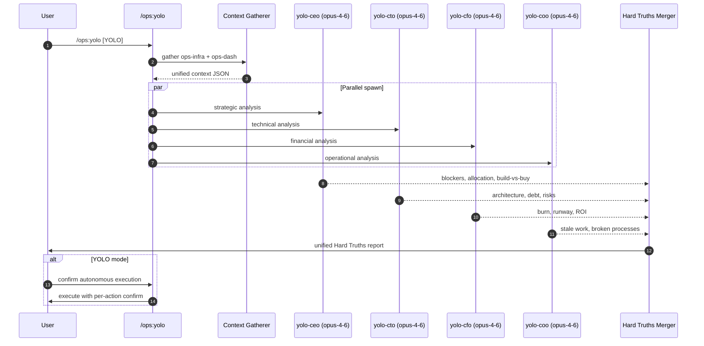

# Agents Reference

_All 21 agents that power claude-ops — scanners, fixers, C-suite analysts, and the daemon brain_

---

All 21 agents in claude-ops v2.1.0. Agent files live in `agents/`.

> [!NOTE]
> v2.0 added four pre-installed specialists — `general-purpose` (override), `deploy-fixer`, `build-fixer`, `dependency-auditor`. These power the deploy auto-fix subsystem and are silently routed to via the PreToolUse:Agent hook. See [`agents.md`](agents.md) for the v2 specialist catalog and [`deploy-fix.md`](deploy-fix.md) for the auto-fix subsystem.

> [!NOTE]
> Agents are spawned by skills — they are not invoked directly. Each has a `memory` scope for cross-session learning and a defined `effort` level that controls token budget.

> [!IMPORTANT]
> **v1.1.0 model bumps:** All scanner, fix, and daemon agents upgraded to **session default (no pin)**. All C-suite analysts upgraded to **session default (no pin)**. The `memory-extractor` stays on Haiku for cost — it's the only background service that runs every 30 min on every box.

---

## 🔎 Background Scanner Agents

These agents run in the background, feeding structured JSON data to the main skills.

| Agent             | Model               | Effort | maxTurns | Tools            | Consumed by               |
| ----------------- | ------------------- | ------ | -------- | ---------------- | ------------------------- |
| `comms-scanner`   | session default (no pin) | low    | 10       | Bash (read-only) | `ops-inbox`, `ops-go`     |
| `infra-monitor`   | session default (no pin) | low    | 15       | Bash             | `ops-fires`, `ops-deploy` |
| `project-scanner` | session default (no pin) | low    | 15       | Bash             | `ops-projects`, `ops-go`  |
| `revenue-tracker` | session default (no pin) | medium | 20       | Bash             | `ops-revenue`, `ops-go`   |

### `comms-scanner` · `agents/comms-scanner.md`

- **Model**: session default (no pin)
- **Effort**: low · **maxTurns**: 10
- **Memory**: project scope
- **Tools**: Bash only (read-only)
- **Purpose**: Scans all communication channels (WhatsApp, Email, Slack, Telegram) for FULL inbox state. Classifies each conversation as `NEEDS_REPLY`, `WAITING`, or `HANDLED`. Returns structured JSON consumed by `ops-inbox` and `ops-go`.

### `infra-monitor` · `agents/infra-monitor.md`

- **Model**: session default (no pin)
- **Effort**: low · **maxTurns**: 15
- **Memory**: project scope
- **Tools**: Bash only
- **Purpose**: ECS, Vercel, and AWS health checker. Returns structured JSON with service health, recent deployments, and anomaly flags. Used by `ops-fires` and `ops-deploy`.

### `project-scanner` · `agents/project-scanner.md`

- **Model**: session default (no pin)
- **Effort**: low · **maxTurns**: 15
- **Memory**: project scope
- **Tools**: Bash only
- **Purpose**: Git, PR, and CI status scanner across all registered repos. Returns structured JSON with branch state, uncommitted files, open PRs, and CI status for each project.

### `revenue-tracker` · `agents/revenue-tracker.md`

- **Model**: session default (no pin)
- **Effort**: medium · **maxTurns**: 20
- **Memory**: project scope
- **Tools**: Bash only
- **Purpose**: Revenue, billing, and credits analysis. Queries AWS Cost Explorer, checks credit balances, cross-references project revenue stages. Returns structured financial snapshot for `ops-revenue` and `ops-go`.

---

## 🛠️ Fix Agents

These agents are dispatched when issues are found and need resolution.

### `triage-agent` · `agents/triage-agent.md`

- **Model**: session default (no pin)
- **Effort**: high · **maxTurns**: 40
- **Isolation**: worktree (sandboxed)
- **Purpose**: Investigates a specific issue from Sentry, Linear, or GitHub. Finds the root cause in code, checks if it's already fixed, and either confirms resolution or creates a fix branch with a PR. Runs in an isolated worktree to avoid polluting the main working tree.

> [!TIP]
> `triage-agent` runs in a sandboxed worktree — changes never bleed into your main working tree until a PR lands. Safe to fire-and-forget from `/ops:triage`.

---

## 💼 C-Suite Analysis Agents

All four run in **parallel** when `/ops:yolo` is invoked. Each uses **Opus 4.6** for maximum analytical depth.

> [!IMPORTANT]
> **v1.1.0 bump:** all four C-suite agents now run on session default (no pin) (up from session default (no pin) in v0.7.x). Expect sharper reasoning and slightly higher per-run token cost.

### C-Suite Spawn Flow

> [!IMPORTANT]
> `Hard Truths Merger` in the diagram above is the **main `/ops:yolo` skill orchestrator** running in the Claude Code main agent context — NOT a separate agent. It reads all four parallel analysis files (`ceo-analysis.md`, `cto-analysis.md`, `cfo-analysis.md`, `coo-analysis.md`) and composes the unified report. `yolo-ceo` is a peer agent with its own strategic perspective; it does not synthesize the others' work.

> **v2.3.1 — competitor context auto-loaded.** Each C-suite agent now sources `scripts/lib/competitor/context.sh` at the start of its run and calls `competitor_vertical_slice <role>` to pull a role-filtered slice of last-7d high-severity competitor events. The slice is folded into each agent's analysis. Skipped silently when competitor-intel is unconfigured.

### `yolo-ceo` · `agents/yolo-ceo.md`

- **Model**: session default (no pin)
- **Effort**: high · **maxTurns**: 20
- **Purpose**: Strategic priority analysis. Growth blockers, resource allocation, build vs. buy decisions, investor-readiness. No sugar-coating.
- **Competitor slice**: `competitor_vertical_slice ceo` — NEW entrants, comp funding, strategic moves. Factors into market-positioning recommendations.

### `yolo-cto` · `agents/yolo-cto.md`

- **Model**: session default (no pin)
- **Effort**: high · **maxTurns**: 25
- **Purpose**: Technical health analysis. Architecture, tech debt, production risks, scalability limits, and cut corners. Brutally honest about what will break.
- **Competitor slice**: `competitor_vertical_slice cto` — changelog/feature page-diffs, Show HN / Launch HN. Benchmarks tech velocity.

### `yolo-cfo` · `agents/yolo-cfo.md`

- **Model**: session default (no pin)
- **Effort**: high · **maxTurns**: 20
- **Purpose**: Financial analysis. AWS burn rate, runway, ROI on current work, credits expiry, cost anomalies. No optimism without data.
- **Competitor slice**: `competitor_vertical_slice cfo` — pricing diffs with money tokens (severity:high), comp funding rounds. Quantifies revenue impact of competitor pricing moves.

### `yolo-coo` · `agents/yolo-coo.md`

- **Model**: session default (no pin)
- **Effort**: high · **maxTurns**: 25
- **Purpose**: Operations execution analysis. Stale work, broken processes, missing automation, communication failures. What the CEO doesn't see.
- **Competitor slice**: `competitor_vertical_slice coo` — Greenhouse/Lever hiring signals (especially senior roles), layoff signals. Surfaces operational threats and poaching opportunities.

> [!WARNING]
> C-suite agents produce unfiltered "Hard Truths" — they will flag risks, dead projects, and wasted spend by name. Review before sharing with investors or teammates.

---

## ⚙️ Daemon & System Agents

### `daemon-agent` · `agents/daemon-agent.md`

- **Model**: session default (no pin)
- **Effort**: low · **maxTurns**: 10
- **Memory**: project scope
- **Purpose**: Manages the ops background daemon — start, stop, restart services, check health. Spawned by `ops-doctor` and `ops-setup` when daemon configuration changes are needed.

### `doctor-agent` · `agents/doctor-agent.md`

- **Model**: session default (no pin)
- **Effort**: high · **maxTurns**: 30
- **Tools**: Bash, Read, Write, Edit, Grep, Glob (no Agent spawning)
- **Purpose**: Diagnoses and auto-fixes ops plugin configuration errors, manifest issues, broken permissions, invalid JSON, and stale cache copies. Spawned by `/ops:doctor`.

### `memory-extractor` · `agents/memory-extractor.md`

- **Model**: session default (no pin)
- **Effort**: low · **maxTurns**: 10
- **Memory**: project scope
- **Purpose**: Background agent that extracts user profiles, contact cards, and behavioral patterns from chat history. Runs as a daemon service every 30 minutes. Writes structured markdown to `memories/`. Used by all communication skills for context-aware drafting.

> [!NOTE]
> The `memory-extractor` is the only agent that still runs on **Haiku 4.5** — it's optimised for cheap high-frequency extraction. See [`memories-system.md`](memories-system.md) for details.

---

## 🧠 Agent Memory Scopes

| Scope              | What persists                                                           |
| ------------------ | ----------------------------------------------------------------------- |
| `project`          | Remembered across sessions within the same project context              |
| `user`             | Remembered across all projects for the same user                        |
| worktree isolation | Agent runs in a sandboxed worktree — changes don't bleed into main tree |

> [!TIP]
> Memory scope is declared in each agent file's frontmatter. To reset an agent's memory, delete the matching subdirectory in `~/.claude/plugins/data/ops-ops-marketplace/memories/`.
